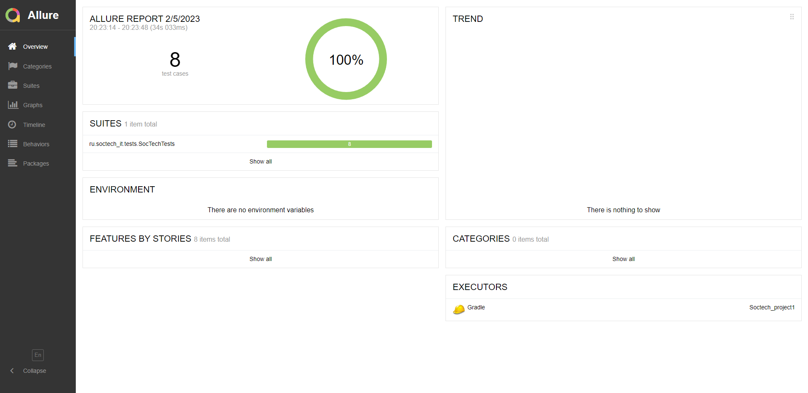
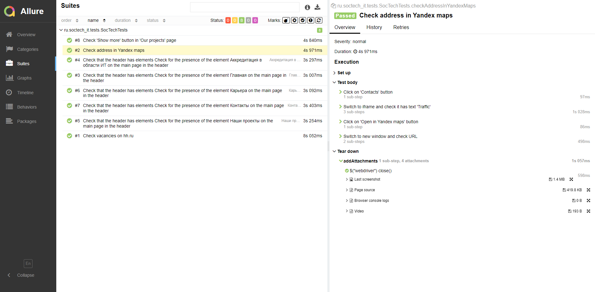
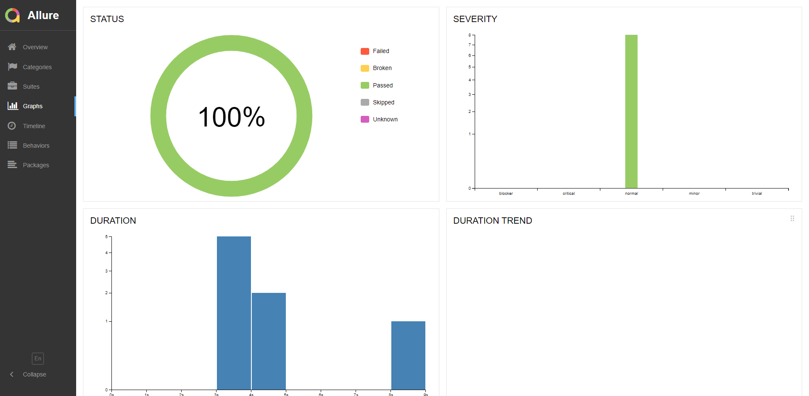

# Проект по автоматизированному тестированию сайта "Соцтех"

<p align="center">

</p>

## <a name="bookmark_tabs-Содержание"></a>:bookmark_tabs: Содержание

➠ [Покрытый функционал](#checkered_flag-покрытый-функционал)

➠ [Технологический стек](#desktop_computer-Технологический-стек)

➠ [Запуск тестов из терминала](#key-запуск-тестов-из-терминала)

➠ [Отчет о результатах тестирования в Allure Report](#-отчет-о-результатах-тестирования-в-allure-report)

## <a name="checkered_flag-покрытый-функционал"></a>:checkered_flag: Покрытый функционал

### UI тесты

- [x] Проверка элементов в хедере страницы
- [x] Проверка кликабельности кнопки 'Показать еще' на странице 'Наши проекты'
- [x] Проверка открытия страницы с вакансиями компания на hh.ru при клике на кнопку 'Наши вакансии на hh.ru'
- [x] Проверка адреса компании на странице яндекс карт

[:arrow_up:Содержание](#bookmark_tabs-Содержание)

## <a name="desktop_computer-Технологический стек"></a>:desktop_computer: Технологический стек

<p align="center">


</p>

[:arrow_up:Содержание](#bookmark_tabs-Содержание)

## :key: Запуск тестов из терминала

### Локальный запуск тестов

```
gradle clean test
```

[:arrow_up:Содержание](#bookmark_tabs-Содержание)

##  Отчет о результатах тестирования в Allure Report

### :large_orange_diamond: Главная страница Allure-отчета

<p align="center">

</p>

### :large_orange_diamond: Страница с тестами

<p align="center">

</p>

> Каждый тест имеет:
>- Скриншот
>- Page source
>- Browser console log

### :large_orange_diamond: Основной дашборд

<p align="center">

</p>

[:arrow_up:Содержание](#bookmark_tabs-Содержание)

